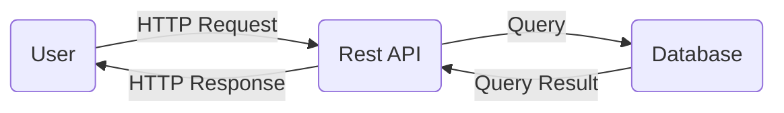

node-red-demo
=============

### About

This is your project's README.md file. It helps users understand what your
project does, how to use it and anything else they may need to know.

```mermaid
graph LR
A(User) -- HTTP Request --> B(Rest API)
B -- Query --> C(Database)
C -- Query Result --> B
B -- HTTP Response --> A
```